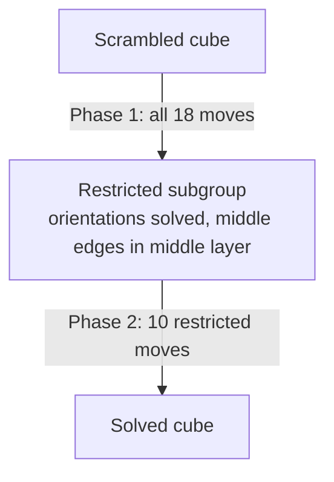

# Rubik's Cube Solver

A Java Rubik's Cube solver that uses **Kociemba's Two-Phase Algorithm** with **IDA\*** search.

The cube is modelled by its 20 movable pieces (8 corners and 12 edges) rather than its 54 stickers. Precomputed pruning tables give admissible heuristics for both phases, so the solver finds a solution without searching the entire state space (about 4.3 × 10¹⁹ states).

---

## Table of Contents

- [Features](#features)
- [How It Works](#how-it-works)
  - [Cube Representation](#cube-representation)
  - [Cube Moves](#cube-moves)
  - [Kociemba's Two-Phase Algorithm](#kociembas-two-phase-algorithm)
  - [Phase 1](#phase-1)
  - [Phase 2](#phase-2)
  - [IDA\* Search](#ida-search)
- [Solving Process](#solving-process)
- [Getting Started](#getting-started)
- [Project Structure](#project-structure)
- [Testing and Verification](#testing-and-verification)
- [Future Work](#future-work)

---

## Features

- Compact **cubie-based** cube representation (positions and orientations)
- All **18 face turns** in standard notation, built from 6 base moves
- **Two-phase search** that splits one huge problem into two smaller ones
- **Pruning tables** that act as heuristics for each phase
- **IDA\*** search with low memory use
- Reads a scrambled cube from a text file and writes the solution to an output file

---

## How It Works

### Cube Representation

The cube is represented by its **cubies** instead of individual stickers.

| Piece type | Count | Stored data | Orientation values |
|---|---|---|---|
| Corners | 8 | Which corner occupies each position, and its orientation | 0, 1, 2 |
| Edges | 12 | Which edge occupies each position, and its orientation | 0, 1 |
| Centres | 6 | Fixed, so not stored | — |

**Corner positions**

```
URF  UFL  ULB  UBR
DFR  DLF  DBL  DRB
```

**Edge positions**

```
UR  UL  UF  UB
FR  FL  BL  BR
DR  DF  DL  DB
```

For example, each corner position records *which* corner piece is currently there and *how it is twisted*. This gives a compact state that is well suited to searching permutations and orientations.

### Cube Moves

The solver supports all 18 face turns:

| Face | Clockwise | Counter-clockwise | Half turn |
|---|---|---|---|
| Up | `U` | `U'` | `U2` |
| Down | `D` | `D'` | `D2` |
| Right | `R` | `R'` | `R2` |
| Left | `L` | `L'` | `L2` |
| Front | `F` | `F'` | `F2` |
| Back | `B` | `B'` | `B2` |

Only the six clockwise moves are defined directly. Each one updates the positions and orientations of the cubies it affects. The rest are built from them:

```
X2 = X X
X' = X X X
```

So all 18 moves share the same underlying move operations.

### Kociemba's Two-Phase Algorithm

Rather than searching for a full solution at once, the algorithm splits the problem into two smaller searches.



### Phase 1

**Goal:** reach a state where

1. all corner orientations are 0,
2. all edge orientations are 0, and
3. the four middle-layer edges (`FR`, `FL`, `BL`, `BR`) are somewhere in the middle layer.

Once these hold, the cube is in the subgroup required for Phase 2. Phase 1 can use all 18 moves.

**Pruning tables.** `Phase1PruningTable.java` builds three tables using breadth-first search from the solved state. Each stores how many moves a given coordinate is from the solved state:

| Coordinate | What it measures |
|---|---|
| Edge orientation | How the 12 edges are flipped |
| Corner orientation | How the 8 corners are twisted |
| Middle-layer edge placement | Which positions the 4 middle-layer edges occupy |

The distances are stored in `HashMap`s and looked up during the search.

**Heuristic.** A solution must satisfy all three conditions, so the largest of the three distances is a lower bound on the moves remaining:

```
h(n) = max(edgeOrientation, cornerOrientation, middleEdgePlacement)
```

### Phase 2

**Goal:** solve the remaining corner and edge permutations without undoing Phase 1.

Phase 2 uses only the moves that keep the Phase 1 conditions intact:

```
U  U'  U2
D  D'  D2
F2  B2  L2  R2
```

**Pruning tables.** `Phase2PruningTable.java` builds tables for:

| Coordinate | What it measures |
|---|---|
| Corner permutation | Arrangement of the 8 corners |
| Middle-layer edge permutation | Arrangement of the 4 middle-layer edges |
| Edge permutation | Arrangement of the 8 top- and bottom-layer edges |

**Heuristic.**

```
h(n) = max(cornerPermutation, middleEdgePermutation, edgePermutation)
```

### IDA\* Search

Both phases use **Iterative Deepening A\***. Each state is scored by

```
f(n) = g(n) + h(n)
```

- `g(n)` is the number of moves already made
- `h(n)` is the pruning-table estimate of the moves still needed

The search explores every state whose `f(n)` is within a threshold. If none of them is a goal state, the threshold increases and the search starts again. Because `h(n)` never overestimates, the moves found within each phase are optimal for that phase. IDA\* also only needs memory for the current path, not every visited state.

---

## Solving Process

1. Represent the scrambled cube by its corner and edge cubies.
2. Look up the Phase 1 heuristic in the pruning tables.
3. Run IDA\* with all 18 moves until the cube reaches the Phase 2 subgroup.
4. Look up the Phase 2 heuristic in its pruning tables.
5. Run IDA\* with the 10 restricted moves to solve the remaining permutations.
6. Combine the Phase 1 and Phase 2 moves into the final solution.

If the cube is already solved after Phase 1, Phase 2 is skipped. The final solution is written as clockwise quarter turns only, so `R'` becomes `RRR` and `U2` becomes `UU`.

---

## Getting Started

**Requirements:** Java 14 or later (the code uses switch expressions)

```bash
git clone https://github.com/paavanr19/rubikscubesolver.git
cd rubikscubesolver
javac *.java
java Solver input.txt output.txt
```

### Input format

The input file is an unfolded net of the cube: 9 lines, with each sticker written as a colour letter.

```
   OOO
   OOO
   OOO
GGGWWWBBBYYY
GGGWWWBBBYYY
GGGWWWBBBYYY
   RRR
   RRR
   RRR
```

- Lines 1–3: **Up** face (columns 4–6)
- Lines 4–6: **Left**, **Front**, **Right**, **Back** faces, side by side
- Lines 7–9: **Down** face (columns 4–6)

The example above is a solved cube. The solver expects this colour scheme:

| Face | Up | Down | Front | Back | Right | Left |
|---|---|---|---|---|---|---|
| Colour | `O` orange | `R` red | `W` white | `Y` yellow | `B` blue | `G` green |

### Output format

The solution is written to the output file as one line of clockwise face turns with no spaces. Apply the moves from left to right to solve the cube.

**Example:** a cube scrambled with a single `U` turn

```
   OOO
   OOO
   OOO
WWWBBBYYYGGG
GGGWWWBBBYYY
GGGWWWBBBYYY
   RRR
   RRR
   RRR
```

produces

```
UUU
```

(three clockwise `U` turns, which is the same as one `U'`).

---

## Project Structure

| File | Purpose |
|---|---|
| `Cubie.java` | Cube state (corner and edge permutations and orientations), reading the input file, and all 18 moves |
| `Phase1PruningTable.java` | Builds the edge orientation, corner orientation and middle-layer placement tables using breadth-first search |
| `Phase2PruningTable.java` | Builds the corner permutation, edge permutation and middle-layer permutation tables using breadth-first search |
| `Solver.java` | IDA\* search for both phases, combining the moves, and the `main` method |

---

## Testing and Verification

Solutions were checked by applying them to scrambled cube states and confirming the cube ended up solved. When the solver produced an incorrect result, I drew out the cube states by hand and compared them with the program's state step by step, using tracebacks to find the move or table entry where they first differed.

---

## Future Work

- A visual interface for entering scrambles and watching the solution play out, planned with Claude Code
